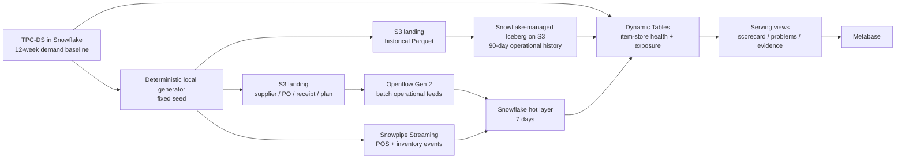

# Snowflake Merchant Decision Intelligence demo

Build a retailer-neutral, item–store–day decision product that answers:

> Which merchandising problems need attention, why are they happening, and what is the sales and
> margin exposure?

TPC-DS supplies governed retail history at scale. A deterministic local Python generator fills the
operational gaps—inventory, suppliers, purchase orders, receipts, plans, and events—without using
an AI service to manufacture bulk rows. Snowflake combines native TPC-DS, 90 days of
Snowflake-managed Iceberg history on S3, and a seven-day hot layer. Dynamic Tables derive the
merchant scorecard, problems, and root-cause evidence; Metabase reads only that serving layer.

## Architecture



CoCo is the engineering copilot across discovery, SQL review, object creation, Openflow setup,
validation, troubleshooting, and tuning. It is intentionally outside the runtime data path and is
not used to generate hundreds of thousands of deterministic fixture values.

## What this repository creates

| Layer | Objects | Retention / size |
|---|---|---|
| TPC-DS | 20 items, 25 stores, observed item/store pairs, 12-week baseline | Existing sample data |
| Iceberg/S3 | Inventory, PO, and supplier-performance history | 90 days |
| Snowflake hot | POS and inventory events plus current suppliers, POs, receipts, and plans | 7 days |
| Analytics | Eight Dynamic Tables | 1–5 minute tutorial targets |
| Serving | Scorecard, problems, root-cause evidence | Current derived state |

At the maximum 500 item/store pairs, the inventory history is 45,000 rows and weekly PO history is
about 6,500 rows. Supplier history, plans, and hot events add only thousands more. The generator
enforces a **100 MB ceiling**; typical output is tens of megabytes or less, not gigabytes. TPC-DS is
the scale proof. Supplemental data demonstrates completeness and fresh behavior.

## Cost-conscious design

- Start with an X-Small warehouse, auto-suspend after 60 seconds, and resume only for a step.
- Keep intermediate Dynamic Tables at `TARGET_LAG = DOWNSTREAM`; only serving tables carry a
  short explicit lag.
- Generate fixtures locally. Use CoCo for high-value Snowflake engineering, not repeated row
  generation.
- Run cohort qualification before unloading or creating downstream objects.
- Stop Openflow runtimes, suspend warehouses, and run cleanup when the demo is finished.
- Review current pricing and account feature availability before running; this repository cannot
  predict account-specific consumption.

## Quick start

The demo has deliberate readiness gates. Do not skip them.

1. Read [architecture](docs/00-architecture.md) and [prerequisites](docs/01-prerequisites.md).
2. Create the Snowflake workspace with [Snowflake setup](docs/02-snowflake-setup.md).
3. Select and qualify the TPC-DS cohort with [cohort selection](docs/03-tpcds-cohort.md).
4. Export the cohort, then generate and validate fixtures:

   ```bash
   python3 -m venv .venv
   source .venv/bin/activate
   pip install -r generator/requirements.txt
   python generator/generate.py --config config/scenario.yaml --cohort data/cohort
   python generator/validate.py --config config/scenario.yaml --cohort data/cohort
   python scripts/estimate_volume.py
   ```

5. Continue in order through [S3 and Iceberg](docs/05-s3-and-iceberg.md),
   [Openflow](docs/06-openflow.md), [streaming](docs/07-snowpipe-streaming.md),
   [Dynamic Tables](docs/08-dynamic-tables.md), and [Metabase](docs/10-metabase.md).
6. Run the [demo scenario](docs/11-demo-scenario.md) only after both local validation and
   `VALIDATION.ASSERT_DEMO_READY()` pass.
7. Use [cleanup](docs/13-cleanup.md) immediately after the exercise.

The full guided path is indexed in [`docs/`](docs/00-architecture.md). SQL filenames begin with the
same execution order. All commands assume the repository root as the current directory.

## Non-goals

- This is not a production sizing benchmark.
- It does not copy TPC-DS into a new database.
- It does not place raw Parquet inside an Iceberg-owned prefix. Snowflake writes the Iceberg data
  and metadata after loading from a separate landing prefix.
- It does not pre-insert the answer shown by the dashboard.
- It does not require CoCo; the checked-in artifacts remain reviewable and runnable without it.

## Validation and security

Run `make check` before publishing. See [SECURITY.md](SECURITY.md) for credential handling and
[CONTRIBUTING.md](CONTRIBUTING.md) for contribution rules. Generated fixtures, cohort exports,
private keys, profiles, and local Metabase state are ignored by Git.

## Documentation

- [00 Architecture](docs/00-architecture.md)
- [01 Prerequisites](docs/01-prerequisites.md)
- [02 Snowflake setup](docs/02-snowflake-setup.md)
- [03 TPC-DS cohort](docs/03-tpcds-cohort.md)
- [04 Data generation](docs/04-data-generation.md)
- [05 S3 and Iceberg](docs/05-s3-and-iceberg.md)
- [06 Openflow](docs/06-openflow.md)
- [07 Snowpipe Streaming](docs/07-snowpipe-streaming.md)
- [08 Dynamic Tables](docs/08-dynamic-tables.md)
- [09 Merchant data products](docs/09-merchant-data-products.md)
- [10 Metabase](docs/10-metabase.md)
- [11 Demo scenario](docs/11-demo-scenario.md)
- [12 Validation](docs/12-validation.md)
- [13 Cleanup](docs/13-cleanup.md)

## License

MIT. See [LICENSE](LICENSE).
